# 👋 hi, i'm Tiago

**full-stack developer from portugal** 🇵🇹
i build the product *and* run the team shipping it

---

### what makes me different

most devs write code. i also run the org around it. right now i'm **COO @ Paddlewheel Inc.** & **Director @ Monitry** — while still shipping features, maintaining infra, and reviewing PRs myself. i went from developer to leadership at multiple companies in under two years, because i don't just build the thing, i make sure it actually ships and keeps running.

if you need someone who can architect a backend *and* own the roadmap, that's the gap i fill.

---

### currently

* 🏢 leading ops & product across HR/management platforms
* 🤖 building Discord integrations & automation
* 🚀 maintaining and shipping SaaS products end to end
* 📚 always picking up something new

---

### stack

**languages**

**frontend**

**backend & data**

**tooling**

---

### featured work

🛰️ **[Orbit](https://github.com/planetaryorbit/orbit)** — HR SaaS platform for staffing, ops & community management. built and maintained it end to end.

📡 **[Monitry](https://beta.monitry.net)** — uptime monitoring & status page platform.

💬 **[Feedbase](https://github.com/breadddevv/feedbase)** — open-source feedback platform for product teams.

🚀 **[Boostify](https://github.com/teamboostify/boostify)** — automated Discord bot for server boost management.

---

### what people say

> "Tiago approaches challenges with curiosity and professionalism, and he is always looking for ways to grow and improve." — **Brennan Peters**, CEO @ Paddlewheel Inc.

> "His expertise in coding, design, and problem-solving is impressive, and he approaches every challenge with professionalism, creativity, and attention to detail." — **2MillionGunGuy**, Director @ Monitry

---

build • lead • ship • repeat

